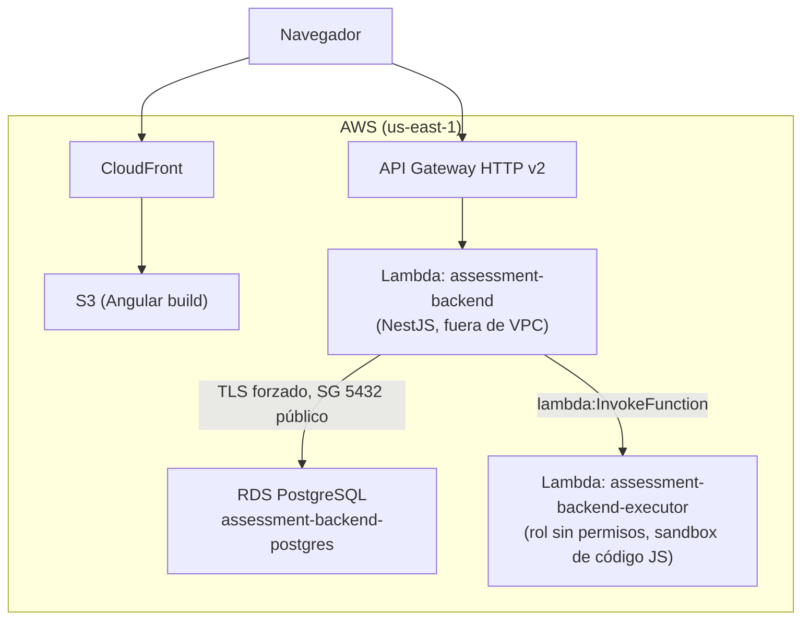
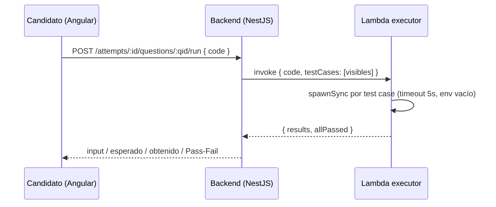

# Assessment Cloud

MVP de una plataforma de evaluaciones técnicas (tipo HackerRank): un reclutador arma un
assessment seleccionando preguntas de una biblioteca (opción múltiple o código), y un
candidato lo resuelve desde una interfaz web, incluyendo un editor con ejecución real de
código JavaScript y resultado Pass/Fail por caso de prueba.

- **Código de la app** (backend + frontend + executor): este repositorio.
- **Infraestructura como código**: [`app-iac`](../app-iac) (Terraform), módulos
  `modules/*/assessment`.

## Funcionalidades

- 📚 **Biblioteca de preguntas** — categoría, dificultad, tipo (opción múltiple / código), CRUD y filtros.
- 📝 **Crear assessment** — selección de preguntas de la biblioteca, con orden.
- 👨‍💻 **Resolver assessment** — wizard pregunta a pregunta: radios para opción múltiple,
  editor de código (CodeMirror) para las de tipo código.
- ▶️ **Ejecutar código** — botón "Ejecutar" corre el código del candidato contra los test
  cases visibles y muestra input / esperado / obtenido / Pass-Fail por caso.
- 🏆 **Resultado** — al finalizar, scoring autoritativo en el servidor (las preguntas de
  código se re-ejecutan contra *todos* los test cases, incluidos los ocultos).
- 📄 **Swagger** — documentación interactiva de la API en `/docs`.
- 🐳 **Docker** — `docker compose up --build` levanta Postgres + backend + frontend
  dockerizados de punta a punta (o solo `docker compose up -d db` para desarrollar con
  hot-reload fuera de contenedor).
- ☁️ **Desplegado en AWS** — Lambda + API Gateway + RDS + S3/CloudFront.

## Arquitectura



**Secuencia de "Ejecutar código":**



### Decisiones y trade-offs

- **Lambda del backend fuera de VPC.** Mismo patrón que la app hermana (`contably`) en
  este mismo repo de IaC: sin NAT ni VPC Interface Endpoints (~$7/mes c/u), la Lambda
  llega a RDS (público) y a la Lambda executor sin infraestructura de red adicional.
  Costo casi cero, apto para una cuenta con budget ajustado.
- **RDS `publicly_accessible=true` con el puerto 5432 abierto a `0.0.0.0/0`, endurecido
  con `rds.force_ssl=1`.** La seguridad real recae en usuario/contraseña (generada por
  Terraform) + TLS obligatorio, no en el security group. Evolución natural a producción:
  mover la Lambda a la VPC con Interface Endpoints, o RDS Proxy + IAM auth.
- **Executor en una Lambda separada, sin permisos.** El código del candidato corre en
  `child_process.spawnSync` con `env: {}`, timeout de 5s por caso y `maxBuffer` de 1MB.
  El rol IAM de esa Lambda solo tiene `AWSLambdaBasicExecutionRole` (logs): aunque el
  código escapara del sandbox de Node, no hay nada que pueda tocar en AWS. Evolución
  natural: contenedores efímeros tipo Firecracker/gVisor si se necesita soportar más
  lenguajes o cargas más pesadas.
- **RDS siempre encendida, sin apagado automático por inactividad.** A diferencia de
  `contably` (que sí tiene ese patrón), esta app es de uso puntual — no vale la pena la
  complejidad del scheduler para un recurso que se va a destruir en pocos días.
- **Solo JavaScript en el editor de código**, no Java. Simplifica drásticamente el
  executor (sin JVM, sin cold starts de varios segundos) manteniendo el requisito
  funcional del reto (ejecutar código, ver output, Pass/Fail).

## Estructura del repo

```
assessment-cloud/
  docker-compose.yml       # Postgres + backend + frontend, dockerizados
  package.json             # scripts de dev y deploy
  deploy-backend.sh / deploy-frontend.sh / deploy-executor.sh
  backend/                 # NestJS (API REST + Swagger) + Dockerfile
  frontend/                # Angular 18 standalone + Dockerfile (nginx)
  executor/                # Lambda JS plano (runner.js + index.js)
```

## Ejecutar en local

Requisitos: Docker (y Node 20+/npm solo si vas a correr fuera de contenedor).

### Opción A — todo dockerizado (bonus Docker)

```bash
docker compose up --build
# Frontend: http://localhost:4200
# Backend:  http://localhost:3000  (Swagger en /docs)
```

Migraciones + seed corren solas al arrancar el contenedor del backend. El frontend se
sirve con nginx y ya apunta a `http://localhost:3000` (publicado por el contenedor del
backend), igual que en desarrollo sin Docker.

### Opción B — hot-reload para desarrollar

```bash
# 1. Solo la base de datos en Docker
docker compose up -d db

# 2. Backend (puerto 3000, migraciones + seed corren solas al arrancar)
cd backend
cp .env.example .env
npm install
npm run start:dev

# 3. Frontend (puerto 4200), en otra terminal
cd frontend
npm install
npm start
```

El seed inicial crea 8 preguntas (5 de opción múltiple, 3 de código) y un assessment de
ejemplo ("Assessment de ejemplo — Fundamentos") listo para probar el flujo completo.

## Tests

```bash
# Runner del executor (4 casos: correcto, incorrecto, timeout, error de sintaxis)
npm run test:executor

# Unit tests del backend (scoring de attempts, dispatch local/lambda del executor,
# validación de assessments) — no requieren base de datos
npm run test:backend

# E2E de flujo completo (biblioteca -> assessment -> intento -> resolver -> finalizar)
# contra un Postgres real. Requiere `docker compose up -d db` corriendo primero;
# usa su propia base "assessment_test", no toca los datos de desarrollo.
npm run test:backend:e2e

# Los tres juntos
npm test
```

El e2e cubre explícitamente los bugs corregidos en revisión de código: input real en
test cases (antes lo rechazaba el ValidationPipe), tope de 20 test cases por pregunta,
opciones huérfanas al editar una pregunta, y el guard de `/attempts/:id/result` que
impide finalizar un intento por navegación accidental a la URL.

## Desplegar en AWS

Requisitos: AWS CLI configurado, Terraform, acceso al repo `app-iac`.

```bash
# 1. Empaquetar los artefactos ANTES del primer apply (Terraform los necesita en disco)
cd backend && npm run package:lambda && cd ..
cd executor && npm run package && cd ..

# 2. Crear la infraestructura (RDS, Lambdas, API Gateway, S3, CloudFront)
npm run deploy:iac        # terraform apply, solo los módulos de assessment

# 3. Desplegar código de las tres piezas
npm run deploy:back       # actualiza la Lambda del backend
npm run deploy:executor   # actualiza la Lambda executor
npm run deploy:front      # build Angular apuntando a la API real + sync a S3 + invalidación CloudFront
```

Los outputs de Terraform (`assessment_api_url`, `assessment_cloudfront_domain_name`, etc.)
quedan disponibles con `terraform output` desde `app-iac/`.

## Qué haría con más tiempo

- Autenticación para el rol reclutador (hoy los endpoints de administración están abiertos).
- Soporte de Java en el executor (contenedor con JDK en vez de Lambda + `spawnSync`).
- Sandbox más fuerte para el executor (vm2/isolated-vm o contenedores efímeros): hoy
  `spawnSync` con `env: {}` y timeout es una mitigación razonable para una kata, pero no
  aísla filesystem/red del proceso.
- Tests unitarios del frontend (hoy la cobertura automatizada es solo backend + e2e).
- Mover la Lambda del backend a la VPC (Interface Endpoints) para cerrar por completo el
  acceso público a RDS.
