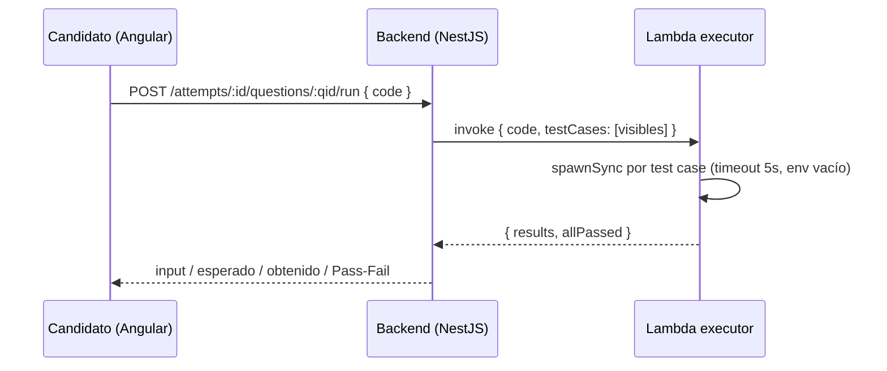

# Assessment Cloud

Plataforma de evaluaciones técnicas (tipo HackerRank): organizaciones que reclutan crean
bancos de preguntas y assessments, invitan candidatos por link, y ven reportes con
gráficas de los resultados. En paralelo, cualquier persona puede registrarse como
candidato y practicar gratis en un catálogo público de simulacros, ganando insignias y
viendo en qué nivel (Junior/Semisenior/Senior) queda según su puntaje.

> **Nota de alcance, honesta:** el reto pide un MVP de unas horas. Esto se
> construyó en varias sesiones como una plataforma real: multi-tenant, con
> candidatos, reportes e insignias — más allá del alcance mínimo pedido, pero
> vale decirlo con esas palabras porque es lo honesto.

- **Código de la app** (backend + frontend + executor): este repositorio.
- **Infraestructura como código real**: [`app-iac`](../app-iac) (Terraform), módulos
  `modules/*/assessment`.
- **Desplegado en AWS**: `https://dkdbmj2vpxalx.cloudfront.net`.
- **Documentación extendida** en [`artifacts/`](artifacts/): arquitectura con
  íconos reales de AWS, costos, guía de arranque local, y Terraform de
  referencia para la arquitectura objetivo.

### ⭐ Bonus

- ✅ **Docker** — `docker compose up --build` levanta todo (Postgres + backend +
  frontend) de punta a punta. Ver [Ejecutar en local](#ejecutar-en-local).
- ✅ **Swagger/OpenAPI** — documentación interactiva de la API en
  [`/docs`](https://g9yvdux2rl.execute-api.us-east-1.amazonaws.com/docs).
- ✅ **Desplegado en AWS** (no Free Tier genérico, sino Lambda + API Gateway +
  RDS + S3/CloudFront reales) — en vivo en
  [`dkdbmj2vpxalx.cloudfront.net`](https://dkdbmj2vpxalx.cloudfront.net).

Checklist completo del enunciado (funcionalidades, stack, bonus,
entregables) con evidencia punto por punto:
[**`artifacts/COMPLIANCE.md`**](artifacts/COMPLIANCE.md).

## Índice

- [⭐ Bonus](#-bonus)
- [Dos sistemas de cuentas, completamente separados](#dos-sistemas-de-cuentas-completamente-separados)
- [Funcionalidades](#funcionalidades)
- [Arquitectura](#arquitectura)
- [Costos](#costos)
- [Estructura del repo](#estructura-del-repo)
- [Ejecutar en local](#ejecutar-en-local)
- [Tests](#tests)
- [Desplegar en AWS](#desplegar-en-aws)
- [Qué haría con más tiempo](#qué-haría-con-más-tiempo)

## Dos sistemas de cuentas, completamente separados

- **Staff de organización** (`Admin` / `Reclutador`): se registra creando una
  organización nueva, invita compañeros de equipo, crea preguntas/bancos/assessments,
  genera invitaciones y ve reportes. JWT con `audience: assessment-cloud-org`.
- **Candidatos**: se registran solos, sin invitación, para practicar. Ven el catálogo
  público de simulacros, su historial y sus insignias. JWT con
  `audience: assessment-cloud-candidates` — un token de un sistema nunca es válido en
  el otro, aunque compartan el mismo `JWT_SECRET`.
- **Candidatos de assessments oficiales** (vía invitación) siguen siendo **anónimos**,
  como en la kata original: no necesitan cuenta, solo el link con token.

## Funcionalidades

### Biblioteca y evaluaciones
- 📚 **Biblioteca de preguntas** — categoría (cerrada: Backend/Frontend/Fullstack/
  DevOps/QA/Data/Mobile/Otro), dificultad, tipo (opción múltiple / código), explicación
  de la respuesta correcta (se muestra al candidato al finalizar).
- 🌐 **Contenido público/privado** — cada pregunta y banco puede compartirse al catálogo
  público (otras organizaciones lo usan de solo lectura) o quedar privado; "Copiar a mi
  biblioteca" es la única forma de editar contenido ajeno.
- 🗂️ **Bancos de preguntas** — agrupa preguntas reutilizables; al crear un assessment se
  puede importar un banco completo de una vez.
- 📝 **Crear assessment** — selección de preguntas, tipo **Oficial** (requiere
  invitación) o **Simulacro** (público, sin invitación), tiempo límite opcional
  (cuenta regresiva en el wizard, cortado también del lado del servidor), y umbrales de
  nivel (% de score para Junior/Semisenior/Senior).
- 👨‍💻 **Resolver assessment** — wizard pregunta a pregunta: radios para opción múltiple,
  editor de código (CodeMirror) para las de tipo código.
- ▶️ **Ejecutar código** — botón "Ejecutar" corre el código contra los test cases
  visibles; al finalizar se re-ejecuta contra *todos*, incluidos los ocultos.
- 🏆 **Resultado** — score, nivel alcanzado, explicación por pregunta, y una encuesta
  breve y opcional de satisfacción con la plataforma.

### Candidatos y simulacros
- 🆓 **Catálogo público de simulacros** — cualquier candidato registrado los practica sin
  invitación; los resultados son privados y nunca aparecen en el reporte de una
  organización.
- 🔁 **Reintentos** — a diferencia de las invitaciones oficiales, un simulacro se puede
  volver a intentar cuantas veces se quiera.
- 🏅 **Insignias** — primer simulacro completado, rachas de 5/10 simulacros, puntaje
  perfecto, y una por cada nivel alcanzado. Se otorgan una sola vez por candidato y se
  muestran con un aviso al finalizar, además de una colección en "Mi historial".
- 📜 **Historial** — todos los intentos de práctica con su score, nivel y fecha.

### Organización
- 👥 **Roles** — Admin (invita usuarios, ve todo) y Reclutador. Invitar a un compañero
  genera un link de activación para copiar/enviar (sin envío de email real).
- ✉️ **Invitaciones a candidatos oficiales** — link con token único, sin cuenta
  requerida; retoma el mismo intento si se reabre a mitad o después de completado.
- 📊 **Reportes** — por assessment: candidatos invitados/completados, tasa de
  completitud, score promedio, distribución de niveles, tasa de acierto por pregunta
  (para detectar preguntas mal calibradas), y export a CSV. Vista general: todos los
  assessments oficiales comparados entre sí, agrupados por categoría de pregunta.
- 📄 **Paginación** en todas las listas (preguntas, bancos, assessments, invitaciones,
  usuarios, historial de candidatos, catálogo e historial de simulacros).
- 🌓 **Modo claro/oscuro** en toda la app.
- 🧭 **Tour guiado** — un recorrido breve la primera vez que se entra, distinto para
  staff de organización y para candidatos.

### Plataforma
- 📄 **Swagger** — documentación interactiva de la API en `/docs`.
- 🐳 **Docker** — `docker compose up --build` levanta Postgres + backend + frontend
  dockerizados de punta a punta (o solo `docker compose up -d db` para desarrollar con
  hot-reload fuera de contenedor).
- ✅ **CI en GitHub Actions** — cada PR a `staging`/`master` corre las pruebas unitarias
  de backend y frontend (`.github/workflows/requirements.yml`).
- ☁️ **Desplegado en AWS** — Lambda + API Gateway + RDS + S3/CloudFront.

## Arquitectura

Diagramas con los íconos reales de cada servicio de AWS, comparando la
arquitectura desplegada hoy contra el siguiente paso natural (VPC, RDS Proxy,
read replica, executor en contenedor efímero), con el porqué de cada elección:
[**`artifacts/ARCHITECTURE.md`**](artifacts/ARCHITECTURE.md).

La Lambda del backend es un único NestJS que expone, entre otros, estos módulos:
`auth` (staff de organización), `candidate-auth` + `practice` (candidatos y
simulacros, JWT con audience propia), `question-banks`, `badges`, `reports`,
`invitations` — todo en el mismo proceso, sin infraestructura nueva por módulo.

**Secuencia de "Ejecutar código":**



### Decisiones y trade-offs

- **Node + NestJS sobre Java + Spring Boot** (el reto permitía cualquiera de los dos).
  Comparte TypeScript con el frontend, y NestJS da estructura modular (decoradores,
  DI, guards) sin el costo de cold-start de una JVM en Lambda.
- **PostgreSQL** (el reto dejaba libre la elección de base de datos: H2, PostgreSQL,
  MongoDB...). El dominio es fuertemente relacional (organización → usuarios →
  assessments → intentos → respuestas) con integridad referencial y transacciones
  reales — modelarlo en un documento NoSQL habría significado reimplementar eso a mano.
- **Lambda del backend fuera de VPC.** Sin NAT ni VPC Interface Endpoints (~$7/mes c/u),
  la Lambda llega a RDS (público) y a la Lambda executor sin infraestructura de red
  adicional. Costo casi cero, apto para una cuenta con budget ajustado.
- **RDS `publicly_accessible=true` con el puerto 5432 abierto a `0.0.0.0/0`, endurecido
  con `rds.force_ssl=1`.** La seguridad real recae en usuario/contraseña (generada por
  Terraform) + TLS obligatorio, no en el security group. Evolución natural a producción:
  mover la Lambda a la VPC con Interface Endpoints, o RDS Proxy + IAM auth.
- **Executor en una Lambda separada, sin permisos.** El código del candidato corre en
  `child_process.spawnSync` con `env: {}`, timeout de 5s por caso y `maxBuffer` de 1MB.
  El rol IAM de esa Lambda solo tiene `AWSLambdaBasicExecutionRole` (logs): aunque el
  código escapara del sandbox de Node, no hay nada que pueda tocar en AWS.
- **Dos audiences de JWT, un solo secreto.** Lo que aísla al staff de organización de
  los candidatos es el claim `aud`, verificado por dos estrategias Passport distintas
  (`jwt-org` / `jwt-candidate`) — no hace falta un secreto por sistema, pero sí que cada
  guard valide su propia audience.
- **Multi-tenant por `organizationId` explícito en cada query**, no solo por guard.
  Contenido público/privado es una dimensión ortogonal: la propiedad (`organizationId`)
  sigue gateando todas las mutaciones; `visibility` solo gatea lecturas cross-tenant.
  Cubierto con un test e2e de regresión permanente.
- **La práctica libre nunca se reporta a una organización.** Estructural, no un filtro
  post-hoc: los intentos de simulacro tienen `candidateId` (nunca `organizationId` de
  quien lo completó), y el endpoint de reporte de una organización rechaza con 400 si
  el assessment es de tipo `PRACTICE`.
- **RDS siempre encendida, sin apagado automático por inactividad.** Uso puntual, no
  justifica ese patrón acá.
- **Solo JavaScript en el editor de código**, no Java. Simplifica drásticamente el
  executor manteniendo el requisito funcional del reto.

## Costos

| | Actual (desplegado hoy) | Objetivo (alto tráfico sostenido) |
|---|---:|---:|
| **Total mensual estimado** | ~$0–17/mes | ~$185/mes |

Lo desplegado hoy está optimizado deliberadamente para uso puntual: escala
a cero, sin NAT Gateway ni VPC. El objetivo agrega ALB, ECS Fargate (backend
+ pool del executor), RDS Proxy, Read Replica y VPC Interface Endpoints —
capacidad siempre encendida, que solo se justifica con tráfico sostenido.

Desglose recurso por recurso, con el porqué de cada salto de precio y un
camino de adopción gradual: [**`artifacts/COSTS.md`**](artifacts/COSTS.md).

## Estructura del repo

```
assessment-cloud/
  docker-compose.yml       # Postgres + backend + frontend, dockerizados
  package.json             # scripts de dev y deploy
  deploy-backend.sh / deploy-frontend.sh / deploy-executor.sh
  backend/                 # NestJS (API REST + Swagger) + Dockerfile
    src/
      auth/                # staff de organización (JWT audience "org")
      candidate-auth/      # candidatos (JWT audience "candidates")
      candidates/          # entidad + servicio de Candidate
      practice/            # catálogo de simulacros, iniciar, historial, insignias
      badges/              # catálogo de insignias + otorgamiento
      questions/           # biblioteca de preguntas
      question-banks/      # bancos reutilizables
      assessments/         # crear/listar assessments + cómputo de nivel
      attempts/            # resolver un intento, scoring, feedback
      invitations/         # invitaciones a candidatos oficiales (anónimas)
      reports/             # reporte por assessment + overview de organización
      users/ organizations/# staff y organizaciones
      migrations/          # migraciones SQL crudas, numeradas
  frontend/                # Angular 18 standalone + Dockerfile (nginx)
  executor/                # Lambda JS plano (runner.js + index.js)
```

## Ejecutar en local

Guía rápida y directa, paso a paso (Docker o hot-reload, requisitos, primer
ingreso, tests, problemas comunes): [**`artifacts/LOCAL_SETUP.md`**](artifacts/LOCAL_SETUP.md).

## Tests

Comandos para correrlos: [`artifacts/LOCAL_SETUP.md`](artifacts/LOCAL_SETUP.md#correr-los-tests).

El e2e de backend cubre, entre otras cosas: fuga cross-tenant entre organizaciones
(regresión permanente), invitaciones oficiales de punta a punta (generar → aterrizar →
retomar → completar), simulacros con insignias otorgadas correctamente en rachas y sin
duplicarse, aislamiento de guards entre el JWT de organización y el de candidatos, y
reportes bloqueando estructuralmente la práctica libre.

La cobertura de tests unitarios es parcial en ambos lados (backend: los servicios más
críticos; frontend: solo `PaginatorComponent`) y no hay todavía una suite de e2e de
frontend corrible en CI — la verificación de UI durante el desarrollo se hizo con
Playwright ad-hoc, sin quedar como suite versionada.

## Desplegar en AWS

Requisitos: AWS CLI configurado, Terraform, acceso al repo `app-iac`.

```bash
# 1. Empaquetar los artefactos ANTES del primer apply (Terraform los necesita en disco)
cd backend && npm run package:lambda && cd ..
cd executor && npm run package && cd ..

# 2. Crear/actualizar la infraestructura (RDS, Lambdas, API Gateway, S3, CloudFront,
#    secreto JWT generado por Terraform)
npm run deploy:iac

# 3. Desplegar código de las tres piezas
npm run deploy:back       # actualiza la Lambda del backend
npm run deploy:executor   # actualiza la Lambda executor
npm run deploy:front      # build Angular apuntando a la API real + sync a S3 + invalidación CloudFront
```

`deploy-frontend.sh` genera `frontend/src/environments/environment.prod.ts` a partir
del output real de Terraform antes de compilar (y lo restaura después) — así el build
de producción (`ng build`, que usa `fileReplacements` en `angular.json`) siempre apunta
a la API desplegada, sin tocar el `environment.ts` que usa el desarrollo local.

Los outputs de Terraform (`assessment_api_url`, `assessment_cloudfront_domain_name`,
`jwt_secret`, etc.) quedan disponibles con `terraform output` desde `app-iac/`.

🧱 **Terraform de referencia para la arquitectura objetivo** (VPC, ALB, ECS
Fargate, RDS Proxy, Read Replica) — validado pero no aplicado, no es la
infraestructura real de este proyecto, es el punto de partida para cuando
el tráfico lo justifique: [`artifacts/terraform-target/`](artifacts/terraform-target/).

## Qué haría con más tiempo

Ya diseñados y con Terraform de referencia listo, pendientes solo de que el
tráfico los justifique — ver [Arquitectura](#arquitectura) y [Costos](#costos):

- **Sandbox más fuerte para el executor** — contenedor efímero por ejecución
  (ECS Fargate, pool cálido) en vez de `spawnSync`, que no aísla filesystem/red
  dentro de la misma Lambda.
- **Cerrar el acceso público a RDS** — VPC con subnets privadas, RDS Proxy y
  Read Replica, en vez de la instancia pública actual.

Genuinamente sin explorar todavía:

- Soporte de otros lenguajes en el executor (Java, Python), no solo JavaScript.
- Ampliar cobertura de tests unitarios (backend y frontend) y sumar una suite de e2e de
  frontend corrible en CI, no solo scripts de Playwright ad-hoc.
- Notificaciones por email reales (invitaciones y activación de cuenta hoy generan un
  link para copiar/enviar manualmente, sin AWS SES).
- Catálogo de insignias configurable desde el admin (hoy es un catálogo fijo en código,
  deliberadamente simple para el alcance actual).
