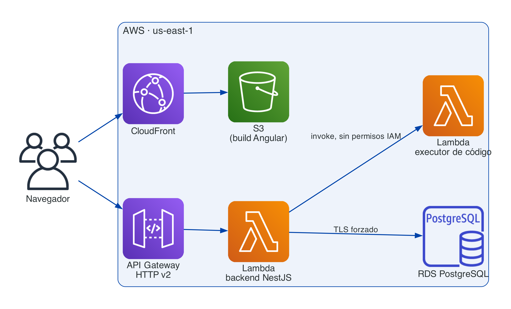
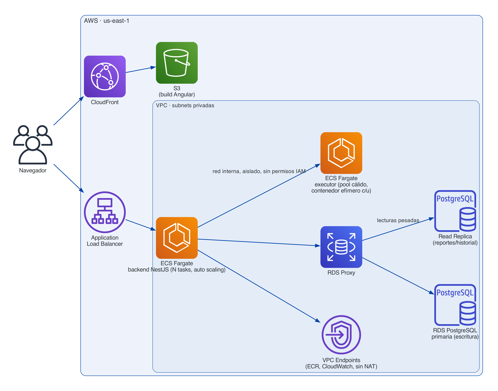

# Arquitectura: actual vs. objetivo

Dos versiones de la misma arquitectura en AWS: la que está **realmente desplegada
hoy** (optimizada por costo, ver [README](../README.md#decisiones-y-trade-offs))
y la que sería el **siguiente paso natural** cuando el tráfico deja de ser
puntual y se vuelve sostenido — ahí el cálculo de costo/beneficio cambia, y
pagar por capacidad siempre encendida sale más barato (y más rápido) que
pagar por invocación.

Costos exactos de ambos escenarios: [`COSTS.md`](COSTS.md). Terraform de
referencia para implementar el objetivo cuando corresponda:
[`terraform-target/`](terraform-target/).

## Actual — optimizada por costo

| Servicio | Por qué se eligió |
|---|---|
| **Lambda** para el backend (fuera de VPC) | Pago por invocación, escala a cero. Con tráfico puntual esto es casi gratis — no tiene sentido pagar por un servidor prendido 24/7 que la mayor parte del tiempo no recibe requests. |
| **Sin VPC propia** (ni NAT Gateway ni VPC Interface Endpoints) | Esa infraestructura de red cuesta ~$32–40/mes fijos, sin importar el tráfico — a este volumen, más que toda la plataforma junta. Sin VPC, la Lambda llega directo a RDS y a la Lambda executor sin nada de por medio. |
| **RDS PostgreSQL público**, con `rds.force_ssl=1` | Consecuencia directa de no tener VPC: es la única forma de que la Lambda llegue a la base. Se compensa con TLS obligatorio a nivel de parameter group y credenciales fuertes generadas por Terraform — la seguridad real recae ahí, no en el Security Group. |
| **Una sola instancia RDS**, sin réplica | A este volumen una instancia entera sobra para lecturas y escrituras juntas; separar una réplica sería gasto sin beneficio real todavía. |
| **Lambda separada para el executor**, rol IAM sin permisos, `spawnSync` | Aislamiento por invocación (cada una en su propia microVM Firecracker) es suficiente para el volumen actual, sin tener que mantener infraestructura de contenedores. |
| **CloudFront + S3** para el frontend | Sirve estático a costo marginal ~cero — la única pieza que ya es óptima en cualquier escala, por eso no cambia en el objetivo. |

Es la arquitectura correcta para el alcance actual: tráfico puntual, cuenta con
budget ajustado, sin SLA de disponibilidad.

## Objetivo — para alto tráfico sostenido

| Cambio | Por qué el cambio |
|---|---|
| Backend: **Lambda → ECS Fargate** (N tasks, auto scaling) detrás de un **ALB** | Con tráfico sostenido, el costo por invocación de Lambda termina superando el costo fijo de tasks siempre encendidos — y el cold start deja de ser ocasional para volverse constante. Reutiliza el mismo `backend/Dockerfile` que ya existe para desarrollo local, así que no hay pipeline de empaquetado nuevo que construir. |
| **VPC propia** con subnets privadas + **VPC Endpoints** (ECR, CloudWatch, sin NAT) | A mayor tráfico, cerrar el acceso público a RDS deja de ser opcional — es superficie de ataque real, no solo teórica — y el costo fijo de la VPC ya se diluye entre mucho más tráfico. |
| **RDS Proxy** delante de PostgreSQL | Con varios tasks de ECS corriendo en paralelo, cada uno con su propio pool de conexiones de TypeORM, Postgres se queda sin conexiones disponibles bajo carga. RDS Proxy multiplexa ese pool en vez de dejar que cada task abra las suyas. |
| **Read Replica** dedicada a reportes/historial | Los reportes y el historial de candidatos son queries pesadas de agregación que, a alto tráfico, empiezan a competir por recursos con las escrituras de intentos en vivo — separarlas evita que un reporte lento afecte a alguien resolviendo un assessment en ese momento. |
| Executor: **Lambda → ECS Fargate**, como *pool cálido* de tasks | `spawnSync` no aísla filesystem ni red dentro de la misma Lambda — solo el proceso. Un pool de contenedores ya calientes da aislamiento real por ejecución (cada una en su propio contenedor efímero) sin pagar la penalidad de 10-30s que tendría arrancar un task nuevo por cada clic de "Ejecutar". |
| CloudFront + S3 | **Sin cambios.** Ya es la pieza óptima en cualquier escala — no hay ningún trigger que justifique tocarla. |

Ningún cambio de este lado deja un cuello de botella pendiente: cada pieza
resuelve exactamente la limitación que la motivó (RDS Proxy resuelve el
pooling, la réplica resuelve las lecturas pesadas, el pool de Fargate resuelve
el aislamiento). El único requisito que queda fuera de la arquitectura misma
es pedir aumento del límite de concurrencia de la cuenta AWS — es un trámite
de soporte, no un rediseño.
